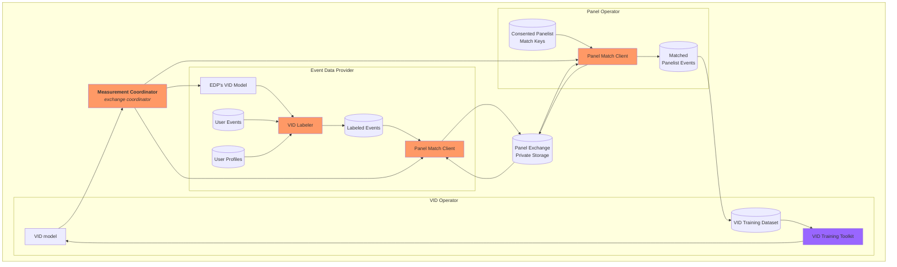
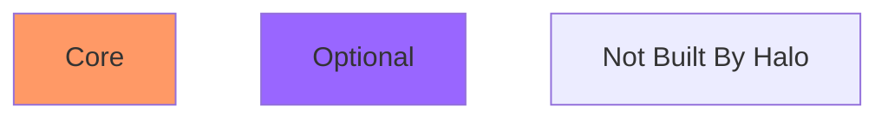
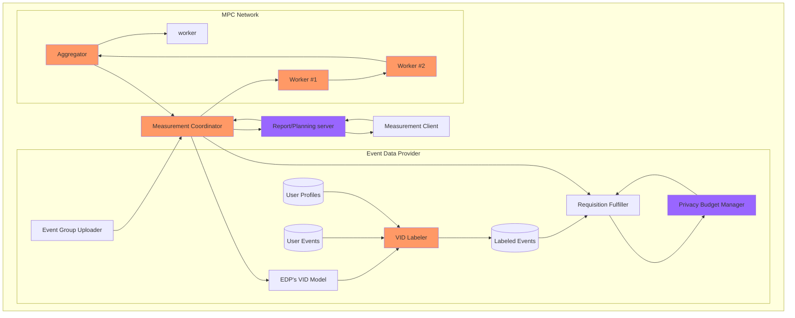

# Overview

The Halo CMM system for Reach and Frequency measurement is an open source implementation of
the [WFA CMM blueprint (2020)](README.md)
.

The open source components of the Halo CMM system are designed to support the Setup Phase and Measurement Phase of the
system.

# Components Overview

## Core components

These components are expected to be used as released by the Halo team, and deployed on every instance of Halo CMM.

<table>
    <tr>
        <td><strong>Component</strong>
        </td>
        <td><strong>Description</strong>
        </td>
    </tr>
    <tr>
        <td>Kingdom - <em>aka Measurement Coordinator</em>
        </td>
        <td>Used to orchestrate measurement requests during the Measurement Phase and coordinate panel data 
             exchange jobs during the Setup Phase.
            

                Used by entities providing the Halo service in a market.
        </td>
    </tr>
    <tr>
        <td>Duchy -<em> aka MPC Node/Aggregator</em>
        </td>
        <td>MPC nodes that make up the MPC consortium for r/f measurement.
            

                Used by MPC operators of a particular instance.
        </td>
    </tr>
    <tr>
        <td>VID Labeler
        </td>
        <td>Library that can be imported by EDPs to label events given a trained VID model
        </td>
    </tr>
    <tr>
        <td>Panellist Exchange Client
        </td>
        <td>Libraries used by the MP and EDP pairs to execute a private double-blind panelist exchange
        </td>
    </tr>

</table>

## Optional Components

These components can be optionally to help entities integrate with core components of Halo CMM. These components can be
modified by integrating entities to suit their needs or used as references to how to integrate with Halo CMM core
components.

<table>
    <tr>
        <td>Privacy Budget Management Library
        </td>
        <td>Reference library and database hooks used by EDPs to maintain Privacy Budgets for Measurement Consumers
        </td>
    </tr>
     <tr>
        <td>FE Reporting/Planning Server
        </td>
        <td>Server that provides services and features to handle scheduling,
            privacy budget optimization and caching of multiple measurement requests & responses.
            

                Used by end user measurement providing entities.
        </td>
    </tr>
    <tr>
        <td>VID training toolkit
        </td>
        <td>Libraries that can be used to help train and VID models.
            

                Used by VID model operators.
        </td>
    </tr>
    <tr>
        <td>Measurement/Reporting CLI(s)</td>
        <td>A set of CLI tools to interact with the measurement coordinator / reporting server.
            
Used by administrators and end user measurement providing entities.
        </td>
    </tr>
</table>

# Setup Phase

# Measurement Phase

